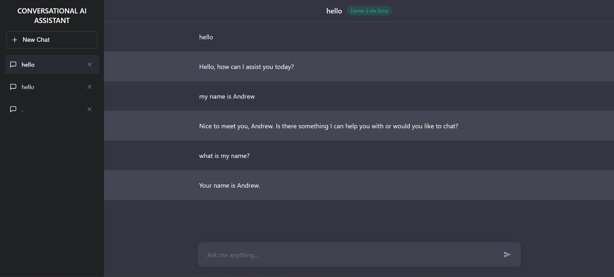

# 🚀 MaiStorage - Conversational AI Assistant with MCP Visualization

A professional, enterprise-grade LLM Chat Interface built. This project features a full-screen multi-session layout, real-time streaming responses, and an integrated **Model Context Protocol (MCP)** style Data Visualization server.



## 🌟 Key Features

-   **Full-Screen Multi-Session Layout**: Sidebar navigation for managing multiple concurrent chat sessions.
-   **Real-Time Streaming**: Tokens are streamed directly from the LLM (Groq) to the UI using `ReadableStream` for an organic chat experience.
-   **MCP-Style Data Visualization**: The LLM can autonomously decide to generate charts (Bar, Line, etc.) by calling an external, dedicated MCP Data Server.
-   **Session Persistence**: All conversations are stored in a local SQLite database using SQLAlchemy.
-   **Context Optimization**: Automatically "scrubs" large message payloads (like Base64 charts) from historical context to maintain performance and stay within token limits.
-   **Microservices Architecture**: Separated concerns between Frontend, Backend Orchestrator, and Tool (MCP) Server.

## 🛠️ Tech Stack

### Frontend
-   **React 19**: Modern UI library for building the chat interface.
-   **Vite 8**: Next-generation frontend tooling for fast development.
-   **Vanilla CSS**: Custom-built responsive design with a premium feel.

### Backend (Orchestrator)
-   **FastAPI**: High-performance Python web framework.
-   **LangChain**: Framework for orchestrating LLM workflows and tool-calling.
-   **Groq (Llama-3.3-70b)**: Lightning-fast inference using LPU accelerators.
-   **SQLAlchemy + SQLite**: For lightweight, reliable data persistence.

### MCP Data Server
-   **FastAPI**: Microservice to handle tool requests.
-   **Matplotlib**: Python library for generating high-quality charts in-memory.

---

## 🚀 Getting Started

### Prerequisites
-   [Docker Desktop](https://www.docker.com/products/docker-desktop/) installed (Recommended)
-   [Groq API Key](https://console.groq.com/keys)

### Method 1: Using Docker (Recommended)

1.  **Configure Environment**:
    Create a `.env` file in the `backend/` directory:
    ```env
    GROQ_API_KEY=your_actual_key_here
    ```

2.  **Launch the System**:
    From the root directory, run:
    ```bash
    docker-compose up --build
    ```

3.  **Access the App**:
    -   **Frontend**: [http://localhost:5173](http://localhost:5173)
    -   **Backend API**: [http://localhost:8000/docs](http://localhost:8000/docs)
    -   **MCP Server**: [http://localhost:8001/docs](http://localhost:8001/docs)

### Method 2: Running Locally (Manual)

#### 1. MCP Data Server
```bash
cd mcp
pip install -r requirements.txt
uvicorn mcp_server:app --port 8001
```

#### 2. Backend Orchestrator
```bash
cd backend
pip install -r requirements.txt
# Add GROQ_API_KEY to your env or .env file
uvicorn main:app --port 8000
```

#### 3. Frontend
```bash
cd frontend
npm install
npm run dev
```

---

## 📁 Project Structure

```text
├── backend/             # FastAPI Orchestrator (Logic, DB, LangChain)
│   ├── main.py          # Entry point & Tool-calling logic
│   ├── database.py      # SQLAlchemy Models & SQLite setup
│   └── requirements.txt  # Python dependencies
├── frontend/            # React + Vite Frontend
│   ├── src/             # UI Components (Sidebar, Chat, etc.)
│   └── package.json     # JS dependencies
├── mcp/                 # MCP Data Visualization Server
│   ├── mcp_server.py    # Chart generation logic
│   └── requirements.txt  # Python dependencies
└── docker-compose.yml   # Multi-container orchestration
```

## 🧪 Testing the Visualization
To test the MCP feature, try sending the following prompt:
> "Show me a bar chart of my monthly sales: Jan 450, Feb 780, Mar 620, Apr 900."

The LLM will recognize the request, call the MCP server, and render an inline PNG chart in the chat!

---

## 📝 License
This project is part of a technical assessment. All rights reserved by the author.
